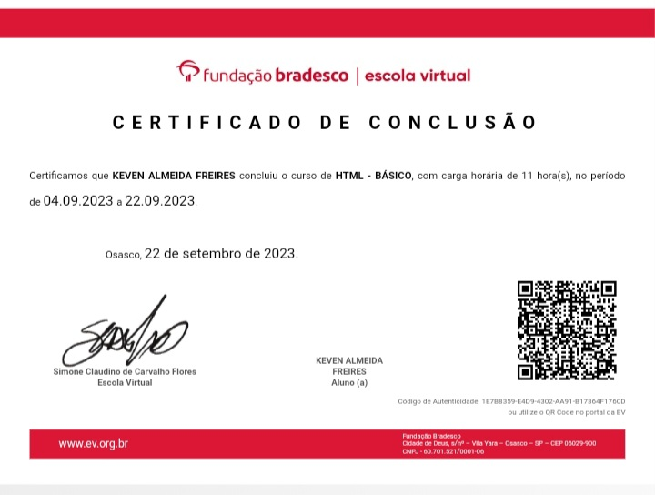

<html>
<head>
</head>
<body>
<h1 align="center">Seja bem vindo ao meu Github!</h1>

<h2 align="center">me chamo Keven Almeida Freires</h2>

<h3 align="center">Rede de Computadores -EEEP MÁRIO ALENCAR</h3>

<h3 align="center">faço parte do Projeto MaSoluções-</h3>

Estudo-Linux,Rede de Computadores,HTML,CSS, segurança da informação, Ubuntu-Server

 

<h1 align="center">Rede Sociais</h1>

 
 
 

</body>
</html>
